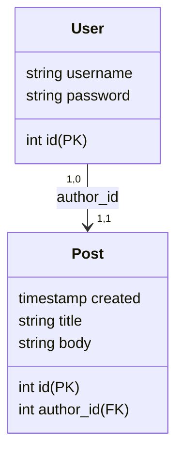

```mermaid
classDiagram
    class User {
        int id (PK)
        string username
        string password
    }
    
    class Post {
        int id (PK)
        int author_id (FK)
        timestamp created
        string title
        string body
    }

    User "1,0" --> "1,1" Post : author_id
```